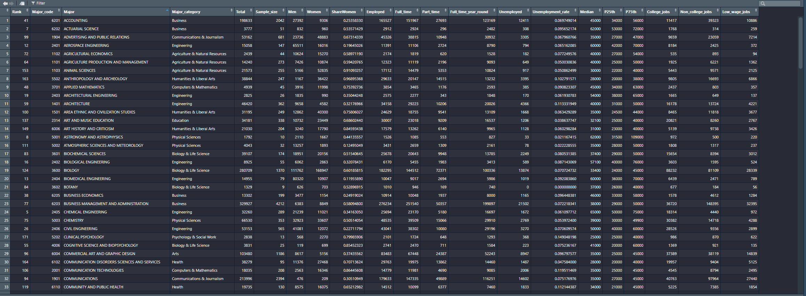
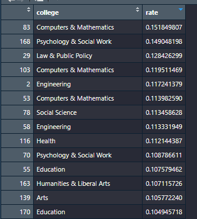
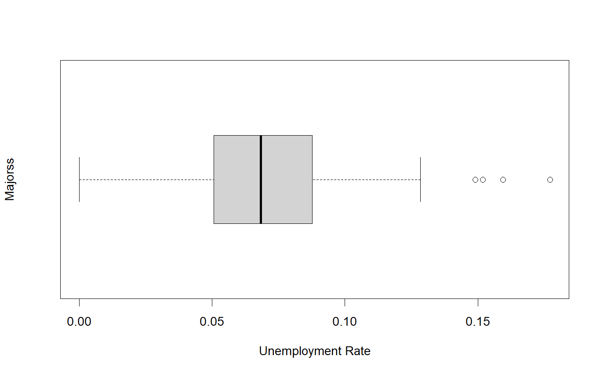
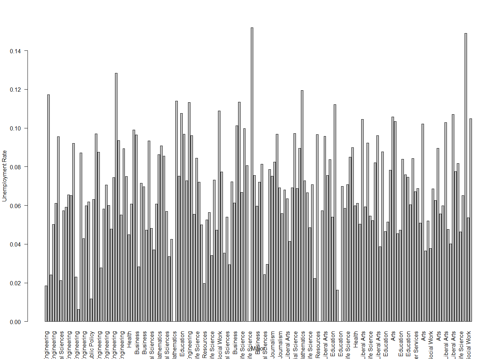
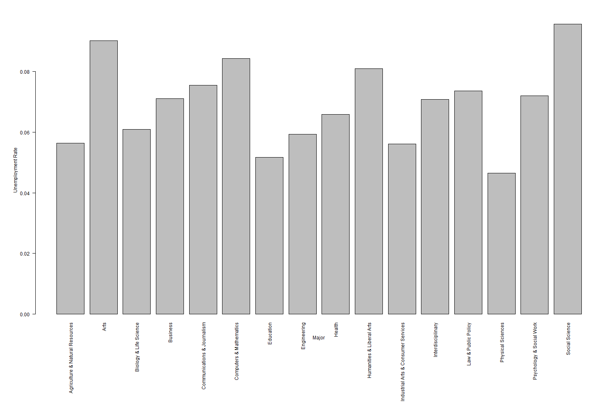

# STATS2332 - Probability and Data Analysis - Final Project

---

### Background & Dataset
This project was completed in RStudio and was conducted over a dataset provided by 
<a href="https://data.world/fivethirtyeight">fivethirtyeight</a> posted on 
<a href="https://data.world/fivethirtyeight/college-majors">data.world</a>. This project aims to test for a statistical
signficance between a degree's college (ie. Engineering, Business, etc.) and the unemployment rate of the sampled
individuals. The dataset contains information on 173 college majors and 173 rows of data. The dataset contains many 
different variables. However, in this project the data is slimmed to only two columns: Major_category and Unemployment_rate.

## Research Question

---
Aiming the direction for this project, I aimed to answer the following research question:

**_How much does a graduate student’s college affect the Return on Investment (ROI) a student may receive in regard to 
the market’s unemployment percentage?_**

From this research question, I created two hypotheses to test for a statistical significance between the two variables.
### Null Hypothesis
A graduate student’s college does **_NOT_** affect the ROI a student may receive in regard to the market’s 
unemployment percentage.

### Alternative Hypothesis
A graduate student’s college **_DOES_** affect the ROI a student may receive in regard to the market’s unemployment percentage.

## Libraries Used
---
-----------------
| Library   | Version |
|-----------|---------|
| ggplot2   | 3.5.1   |
| tidyverse | 2.0.0   |

## Data Filtering & Trimming

---

### Trimming the Data
The dataset contains many different variables. However, in this project the data is slimmed to only two columns: 
Major_category and Unemployment_rate. The data is trimmed to only these two columns to focus on the research question 
and to make the data easier to work with. This is done by creating a new `data.frame()` with only the two columns. These
columns were remapped to `college: dataset$Major_category` and `rate: dataset$Unemployment_rate`.

Dataset Prior to Trimming: 

Dataset Post Trimming: 

### Removing NA Values
The data was also cleaned by removing any NA values. This was done by using the `na.omit()` function in RStudio. This
function removes any rows with NA values. This was done to ensure that the data was clean and that the data was not
skewed by any NA values. This was specifically done post trimming to prevent any NA values from other, unneeded columns,
from altering the data we were working with. This resulted in only 1 row being omitted from our dataset besides 15.

## Methodology

---
### ANOVA
To test for a statistical significance, I used an ANOVA test to compare the means of the unemployment rates of the different
college majors. The ANOVA test was chosen because it is used to compare the means of three or more groups, in which I had
over 16. I conducted these tests in RStudio and used the `aov()` function. 

### Outlier Detection and Impact
I also conducted an outlier detection test to see if any of the data points were skewing the results. I used the `boxplot()`
function in RStudio to visualize the data and see if any outliers were present. There were some outliers on present in 
the data. However, I conducted the **ANOVA** test with and without the outliers to see if the outliers were skewing the
results.

This is the result of the `boxplot()` function: 

## Results

---
### ANOVA Test
The ANOVA test was conducted with and without the outliers. The results of the ANOVA test are as follows:

| Test             | p-value  | Result                 |
|------------------|----------|------------------------|
| With Outliers    | 0.00101  | Reject Null Hypothesis |
| Without Outliers | 0.000209 | Reject Null Hypothesis |

### Did the Outliers Impact the Results?
The results of the ANOVA test show that the outliers did impact the results, however the results of the ANOVA test
with and without the outliers were the same. This means that the outliers did not skew the results of the ANOVA test.

## Conclusion

---
### Results
The results of the ANOVA test show that the null hypothesis can be rejected. This means that a graduate student's college
does affect the ROI a student may receive in regard to the market's unemployment percentage.

### Data Representation

While the data of the results are significant, the data is not conclusive on which majors are the most affected by the
market's unemployment percentage. While each degree has its own unemployment rate, the data does not show which degrees
are the most affected by the market's unemployment rate. If the data is represented as the mean unemployment rate of each
college, the data levels out and the data is not as significant. However, the data does show that the null hypothesis can
be rejected and that a graduate student's college does affect the ROI a student may receive in regard to the market's 
unemployment percentage.

### Bar Graphs of Data
Data represented by each major inside a college vs the mean of each college: 
 

